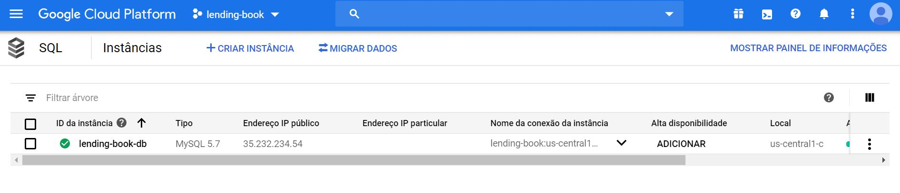
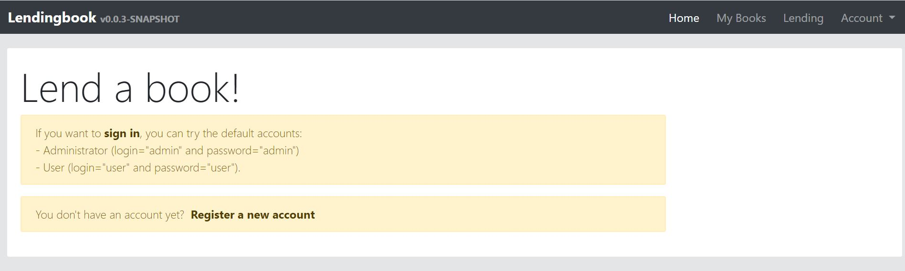

# Lending book app

## Stack

-   Java 8 App Engine
-   Angular 9
-   MySQL on Cloud SQL

-   Webpack

## Dependencies

Run:

    ./mvnw

    npm install

## Production

Command used

    ./mvnw package appengine:deploy -DskipTests -Pgae,dev,prod-gae

The application was deployed to an instance on Google Cloud Plaftorm.

Here the latest deployed version: https://3-dot-lending-book.appspot.com

## Basic login

-   admin / admin
-   user / user
-   system / system

## Steps

1. Sign in
2. Sign up
3. Create your books.
4. Lend book to other users.
